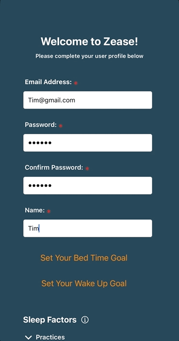
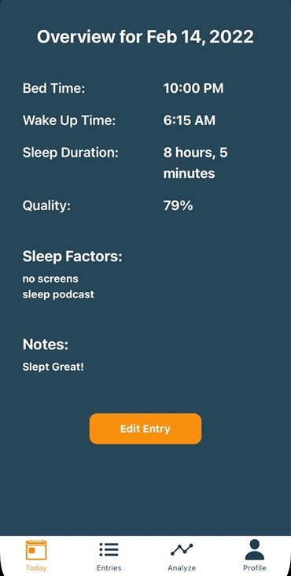

# Zease

Welcome to Zease! Zease is a mobile application (iOS and Android) that allows users to track their sleep habits over time and view detailed information about their sleep habits including data visualizations.
  

## Try it for yourself!

Download the Expo Go App on either your iOS or Android device and scan this QR code:

After successfully downloading Zease, feel free to try creating a new account and experiencing our new user onboarding flow. If you'd like to experience Zease in the same manner as a current user who has already uploaded sleep entries for some time, please feel free to log in with one of the demo users below:

**DEMO USER 1**

_email_: Whitney@gmail.com
_password_: 123456

**DEMO USER 2**

_email_: Randall@yahoo.com
_password_: 123456

If you prefer, you can also view the web version of Zease [HERE](https://zease.vercel.app/)
  
  

## Demo

**NEW USER EXPERIENCE**

  
  

**REGULAR USER EXPERIENCE**

  
  

## Features

- A user can create an account.
- A user can add multiple criteria to their account including their bed time and wake up goals, and any factors that may be impacting their sleep from multiple categories.
- A user who has just created an account can see an onboarding tutorial with detailed information on how to use the app.
- A logged in user can add a daily sleep entry
- A logged in user can view a list of all of their sleep entries, and can select from that list to see expanded data about a specific entry.
- A logged in user can view multiple data visualizations over providing graphical information about their sleep habits.
- A logged in user can view and edit their profile.
    
    

## Tech Stack

**React Native**: Javascript framework created by Meta that combines the best parts of native development with React with a best-in-class JavaScript library for building user interfaces.

**Expo**: A framework and platform built around React Native that helps to develop, build, deploy, and iterate on iOS, Android, and web apps from the same JavaScript/TypeScript codebase.

**Firestore (Realtime Database and Authentication)**: NoSQL document database built for automatic scaling, high performance, and ease of application development.

**Redux**: A predictable state container for JavaScript apps.

**Victory.js**: A set of modular charting components for React and React Native.

**Tailwind CSS**: A utility-first CSS framework for rapidly building custom user interfaces.
  
  

## Team

**Liz Yoder**

[LinkedIn](https://www.linkedin.com/in/alston-white/)

[GitHub](https://github.com/EAHYoder)
  

**Alston White**

[LinkedIn](https://www.linkedin.com/in/liz-yoder/)

[GitHub](https://github.com/alstonwhite)
  

**Sam Kanan**

[LinkedIn](https://www.linkedin.com/in/sammy-kanan-750ba14/)

[GitHub](https://github.com/sammy-k)
  
